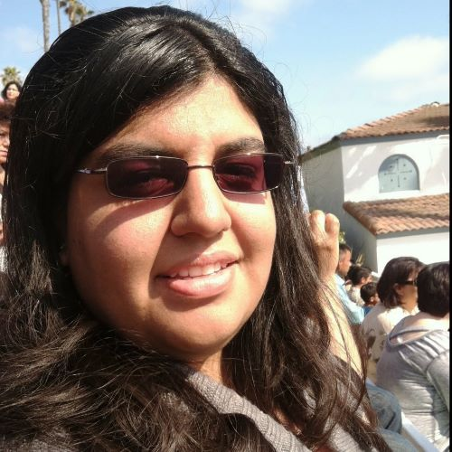

# Karina Elias
## Contact Info:  [Email](mailto:KarinaElias55@gmail.com)  [LinkedIn](https://www.linkedin.com/in/karina-elias-2b5649194/)

## Education
 - **MiraCosta College**
A.S., Computer Science - May 2020

## Skills
- **Primary Languages**: Java, C++
- **Secondary Languages**: Python, C#, HTML, JavaScript, CSS
- **Operating Systems**: Windows, Linux (Ubuntu)
- **Foreign Languages**:  Fluent native Spanish speaker/writer, conversational Japanese

## Work Experience
- **Becton, Dickinson and Company - *Oceanside, CA / San Diego, CA***
	- *Assistant to Manufacturing/Operations (November 2015 - April 2019)*
	- Assisted IT with basic troubleshooting on testing equipment and administrative office computers.
Made indirect procurement of necessary warehouse tools, equipment and services.
Tested motherboards, USB bus drivers, all-in-one computers, and hard drives in controlled electrostatic discharge environment.
Maintained control humidity, temperature, and refurbished products inventory in electrostatic discharge room.

## Honors and Awards
- President's Honor List, MCC, Spring 2018
